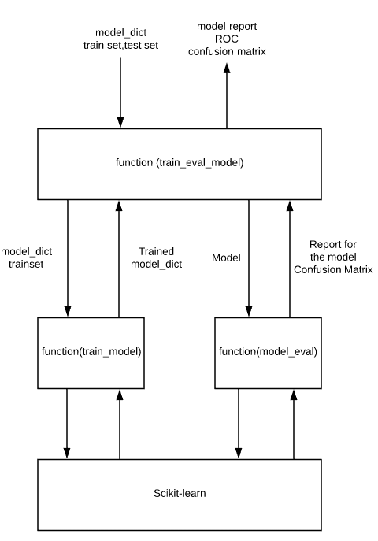
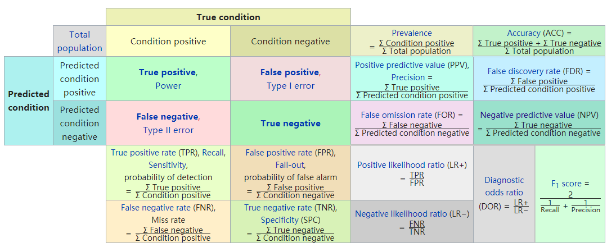
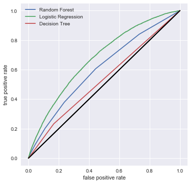
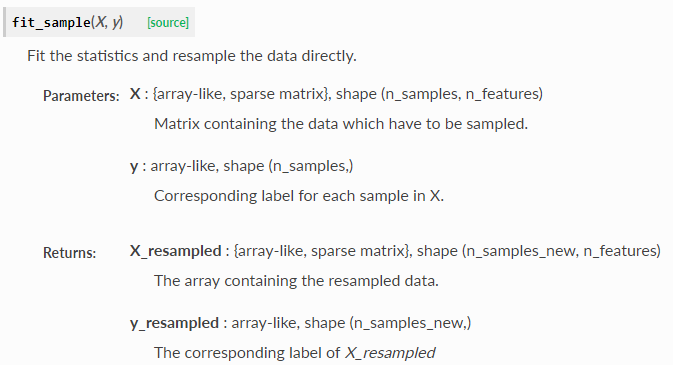
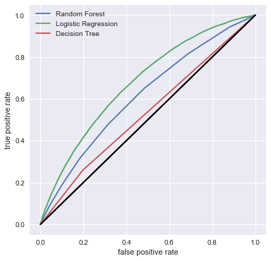
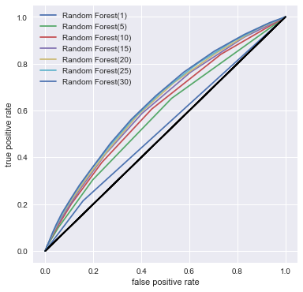
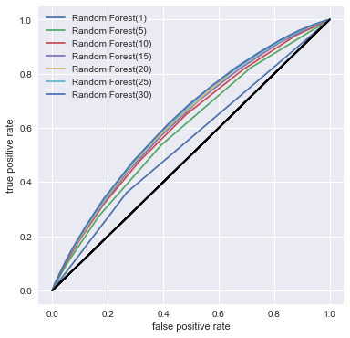
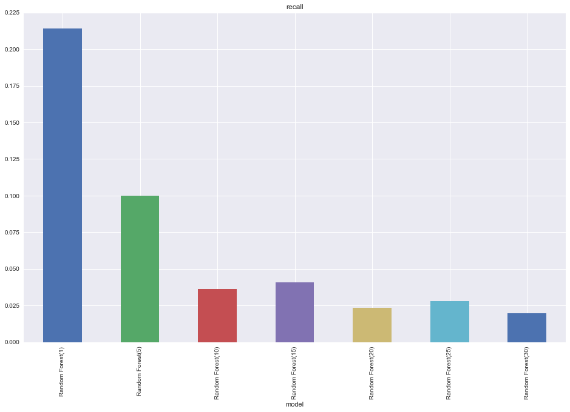
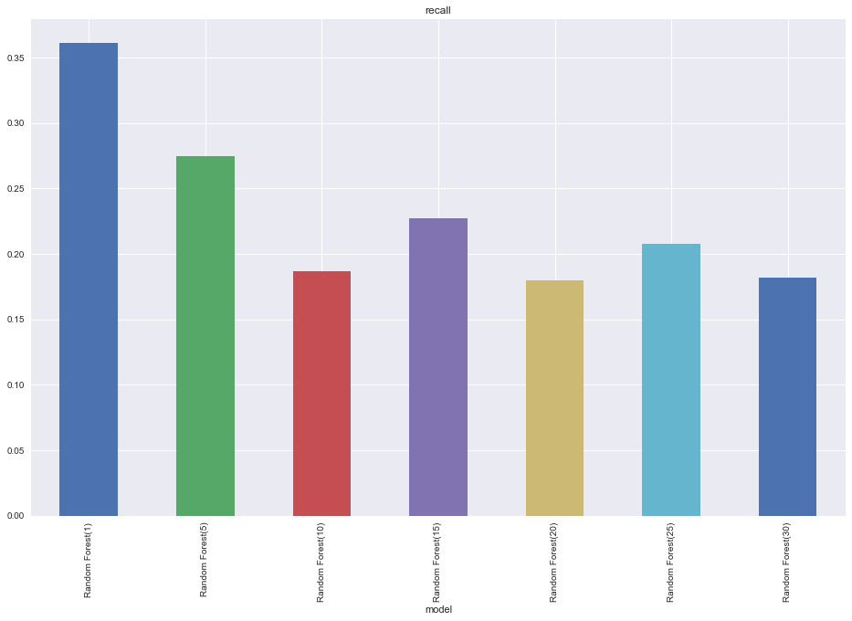

# Loan Default Prediction

### This is the markdown version of the jupyter notebook for easy read online.
### Please find the `Final_Project_Code_Group5.ipynb` for the executable code.

Final Project of Machine Learning I (DATS 6202 - 11, Spring 2018)  
**Authors:** Liwei Zhu,Wenye Ouyang,Xiaochi Li (Group 5)   
Data Science @ The George Washington University  


Data Source: https://www.kaggle.com/wendykan/lending-club-loan-data/data


**Abstract:** Loan default is always the threat to any financial institution and should be predicted in advance based on various features of the applicant. This study aims at applying machine models, including decision tree, logistic regression and random forest to classify applicants with and without loan default from a group of predicting variables, and evaluate their performance. Comparison between using unbalanced training set and balanced training set suggests that balancing the data is the key to improve model performance. The study also found that regression is the best model to classify those applicants with loan default, and the recall score can be 70% with balanced data.

### Environment specification
+ This notebook should be run under python with all necessary Data Science packages, Anaconda environment is recommended.
+ Training the model will occupy a lot of memory (about 3 GB or 2915MB), please turn off other programs if necessary.
+ Please use `conda install -c glemaitre imbalanced-learn` in conda prompt to install SMOTE package, or follow instructions on http://contrib.scikit-learn.org/imbalanced-learn/stable/install.html

## Data Preprocessing


```python
import pandas as pd
import numpy as np
from matplotlib import pyplot as plt
import seaborn as sns
%matplotlib inline
```

### Read data from file


```python
df_loan = pd.read_csv("D:\loan.csv",low_memory=False) #read in the data
```


```python
df_loan.head()
```


<div>
<style scoped>
    .dataframe tbody tr th:only-of-type {
        vertical-align: middle;
    }

    .dataframe tbody tr th {
        vertical-align: top;
    }

    .dataframe thead th {
        text-align: right;
    }
</style>
<table border="1" class="dataframe">
  <thead>
    <tr style="text-align: right;">
      <th></th>
      <th>id</th>
      <th>member_id</th>
      <th>loan_amnt</th>
      <th>funded_amnt</th>
      <th>funded_amnt_inv</th>
      <th>term</th>
      <th>int_rate</th>
      <th>installment</th>
      <th>grade</th>
      <th>sub_grade</th>
      <th>...</th>
      <th>total_bal_il</th>
      <th>il_util</th>
      <th>open_rv_12m</th>
      <th>open_rv_24m</th>
      <th>max_bal_bc</th>
      <th>all_util</th>
      <th>total_rev_hi_lim</th>
      <th>inq_fi</th>
      <th>total_cu_tl</th>
      <th>inq_last_12m</th>
    </tr>
  </thead>
  <tbody>
    <tr>
      <th>0</th>
      <td>1077501</td>
      <td>1296599</td>
      <td>5000.0</td>
      <td>5000.0</td>
      <td>4975.0</td>
      <td>36 months</td>
      <td>10.65</td>
      <td>162.87</td>
      <td>B</td>
      <td>B2</td>
      <td>...</td>
      <td>NaN</td>
      <td>NaN</td>
      <td>NaN</td>
      <td>NaN</td>
      <td>NaN</td>
      <td>NaN</td>
      <td>NaN</td>
      <td>NaN</td>
      <td>NaN</td>
      <td>NaN</td>
    </tr>
    <tr>
      <th>1</th>
      <td>1077430</td>
      <td>1314167</td>
      <td>2500.0</td>
      <td>2500.0</td>
      <td>2500.0</td>
      <td>60 months</td>
      <td>15.27</td>
      <td>59.83</td>
      <td>C</td>
      <td>C4</td>
      <td>...</td>
      <td>NaN</td>
      <td>NaN</td>
      <td>NaN</td>
      <td>NaN</td>
      <td>NaN</td>
      <td>NaN</td>
      <td>NaN</td>
      <td>NaN</td>
      <td>NaN</td>
      <td>NaN</td>
    </tr>
    <tr>
      <th>2</th>
      <td>1077175</td>
      <td>1313524</td>
      <td>2400.0</td>
      <td>2400.0</td>
      <td>2400.0</td>
      <td>36 months</td>
      <td>15.96</td>
      <td>84.33</td>
      <td>C</td>
      <td>C5</td>
      <td>...</td>
      <td>NaN</td>
      <td>NaN</td>
      <td>NaN</td>
      <td>NaN</td>
      <td>NaN</td>
      <td>NaN</td>
      <td>NaN</td>
      <td>NaN</td>
      <td>NaN</td>
      <td>NaN</td>
    </tr>
    <tr>
      <th>3</th>
      <td>1076863</td>
      <td>1277178</td>
      <td>10000.0</td>
      <td>10000.0</td>
      <td>10000.0</td>
      <td>36 months</td>
      <td>13.49</td>
      <td>339.31</td>
      <td>C</td>
      <td>C1</td>
      <td>...</td>
      <td>NaN</td>
      <td>NaN</td>
      <td>NaN</td>
      <td>NaN</td>
      <td>NaN</td>
      <td>NaN</td>
      <td>NaN</td>
      <td>NaN</td>
      <td>NaN</td>
      <td>NaN</td>
    </tr>
    <tr>
      <th>4</th>
      <td>1075358</td>
      <td>1311748</td>
      <td>3000.0</td>
      <td>3000.0</td>
      <td>3000.0</td>
      <td>60 months</td>
      <td>12.69</td>
      <td>67.79</td>
      <td>B</td>
      <td>B5</td>
      <td>...</td>
      <td>NaN</td>
      <td>NaN</td>
      <td>NaN</td>
      <td>NaN</td>
      <td>NaN</td>
      <td>NaN</td>
      <td>NaN</td>
      <td>NaN</td>
      <td>NaN</td>
      <td>NaN</td>
    </tr>
  </tbody>
</table>
<p>5 rows × 74 columns</p>
</div>


```python
df_loan.info()
```

    <class 'pandas.core.frame.DataFrame'>
    RangeIndex: 887379 entries, 0 to 887378
    Data columns (total 74 columns):
    id                             887379 non-null int64
    member_id                      887379 non-null int64
    loan_amnt                      887379 non-null float64
    funded_amnt                    887379 non-null float64
    funded_amnt_inv                887379 non-null float64
    term                           887379 non-null object
    int_rate                       887379 non-null float64
    installment                    887379 non-null float64
    grade                          887379 non-null object
    sub_grade                      887379 non-null object
    emp_title                      835917 non-null object
    emp_length                     842554 non-null object
    home_ownership                 887379 non-null object
    annual_inc                     887375 non-null float64
    verification_status            887379 non-null object
    issue_d                        887379 non-null object
    loan_status                    887379 non-null object
    pymnt_plan                     887379 non-null object
    url                            887379 non-null object
    desc                           126028 non-null object
    purpose                        887379 non-null object
    title                          887227 non-null object
    zip_code                       887379 non-null object
    addr_state                     887379 non-null object
    dti                            887379 non-null float64
    delinq_2yrs                    887350 non-null float64
    earliest_cr_line               887350 non-null object
    inq_last_6mths                 887350 non-null float64
    mths_since_last_delinq         433067 non-null float64
    mths_since_last_record         137053 non-null float64
    open_acc                       887350 non-null float64
    pub_rec                        887350 non-null float64
    revol_bal                      887379 non-null float64
    revol_util                     886877 non-null float64
    total_acc                      887350 non-null float64
    initial_list_status            887379 non-null object
    out_prncp                      887379 non-null float64
    out_prncp_inv                  887379 non-null float64
    total_pymnt                    887379 non-null float64
    total_pymnt_inv                887379 non-null float64
    total_rec_prncp                887379 non-null float64
    total_rec_int                  887379 non-null float64
    total_rec_late_fee             887379 non-null float64
    recoveries                     887379 non-null float64
    collection_recovery_fee        887379 non-null float64
    last_pymnt_d                   869720 non-null object
    last_pymnt_amnt                887379 non-null float64
    next_pymnt_d                   634408 non-null object
    last_credit_pull_d             887326 non-null object
    collections_12_mths_ex_med     887234 non-null float64
    mths_since_last_major_derog    221703 non-null float64
    policy_code                    887379 non-null float64
    application_type               887379 non-null object
    annual_inc_joint               511 non-null float64
    dti_joint                      509 non-null float64
    verification_status_joint      511 non-null object
    acc_now_delinq                 887350 non-null float64
    tot_coll_amt                   817103 non-null float64
    tot_cur_bal                    817103 non-null float64
    open_acc_6m                    21372 non-null float64
    open_il_6m                     21372 non-null float64
    open_il_12m                    21372 non-null float64
    open_il_24m                    21372 non-null float64
    mths_since_rcnt_il             20810 non-null float64
    total_bal_il                   21372 non-null float64
    il_util                        18617 non-null float64
    open_rv_12m                    21372 non-null float64
    open_rv_24m                    21372 non-null float64
    max_bal_bc                     21372 non-null float64
    all_util                       21372 non-null float64
    total_rev_hi_lim               817103 non-null float64
    inq_fi                         21372 non-null float64
    total_cu_tl                    21372 non-null float64
    inq_last_12m                   21372 non-null float64
    dtypes: float64(49), int64(2), object(23)
    memory usage: 501.0+ MB
    

### Remove columns/rows that has too many NA
+ Remove columns whose NA is more than 70%
+ Remove rows whose NA is more than 30


```python
null_rate = df_loan.isnull().sum(axis = 0).sort_values(ascending = False)/float((len(df_loan)))
null_rate[null_rate > 0.7]
```


    dti_joint                      0.999426
    verification_status_joint      0.999424
    annual_inc_joint               0.999424
    il_util                        0.979020
    mths_since_rcnt_il             0.976549
    all_util                       0.975916
    max_bal_bc                     0.975916
    open_rv_24m                    0.975916
    open_rv_12m                    0.975916
    total_cu_tl                    0.975916
    total_bal_il                   0.975916
    open_il_24m                    0.975916
    open_il_12m                    0.975916
    open_il_6m                     0.975916
    open_acc_6m                    0.975916
    inq_fi                         0.975916
    inq_last_12m                   0.975916
    desc                           0.857977
    mths_since_last_record         0.845553
    mths_since_last_major_derog    0.750160
    dtype: float64


```python
df_loan.drop(null_rate[null_rate>0.7].index,axis = 1,inplace=True)
```


```python
df_loan.dropna(axis = 0,thresh=30,inplace = True)
```

### Find out the columns that has too few/ too much unique data
Inspect these columns to decide whether to remove them or not


```python
unique_rate = df_loan.apply(lambda x: len(pd.unique(x)),axis = 0).sort_values(ascending = False) #unique rate and sort
```


```python
unique_rate
```


    id                            887379
    url                           887379
    member_id                     887379
    total_pymnt                   506726
    total_pymnt_inv               506616
    tot_cur_bal                   327343
    total_rec_int                 324635
    emp_title                     299272
    out_prncp_inv                 266244
    total_rec_prncp               260227
    out_prncp                     248332
    last_pymnt_amnt               232451
    revol_bal                      73740
    installment                    68711
    title                          63145
    annual_inc                     49385
    recoveries                     23055
    total_rev_hi_lim               21252
    collection_recovery_fee        20708
    tot_coll_amt                   10326
    funded_amnt_inv                 9856
    total_rec_late_fee              6181
    dti                             4086
    funded_amnt                     1372
    loan_amnt                       1372
    revol_util                      1357
    zip_code                         935
    earliest_cr_line                 698
    int_rate                         542
    mths_since_last_delinq           156
    total_acc                        136
    last_credit_pull_d               104
    issue_d                          103
    next_pymnt_d                     101
    last_pymnt_d                      99
    open_acc                          78
    addr_state                        51
    sub_grade                         35
    pub_rec                           33
    delinq_2yrs                       30
    inq_last_6mths                    29
    purpose                           14
    collections_12_mths_ex_med        13
    emp_length                        12
    loan_status                       10
    acc_now_delinq                     9
    grade                              7
    home_ownership                     6
    verification_status                3
    application_type                   2
    term                               2
    initial_list_status                2
    pymnt_plan                         2
    policy_code                        1
    dtype: int64


```python
def column_analyse(x,df = df_loan): #print count for columns that only has few uniques
    print(df[x].value_counts(),"\n",df[x].value_counts()/len(df[x]))

column_analyse("pymnt_plan")
column_analyse("initial_list_status")
column_analyse("application_type")
column_analyse("acc_now_delinq")
```

    n    887369
    y        10
    Name: pymnt_plan, dtype: int64 
     n    0.999989
    y    0.000011
    Name: pymnt_plan, dtype: float64
    f    456848
    w    430531
    Name: initial_list_status, dtype: int64 
     f    0.514829
    w    0.485171
    Name: initial_list_status, dtype: float64
    INDIVIDUAL    886868
    JOINT            511
    Name: application_type, dtype: int64 
     INDIVIDUAL    0.999424
    JOINT         0.000576
    Name: application_type, dtype: float64
    0.0     883236
    1.0       3866
    2.0        208
    3.0         28
    4.0          7
    5.0          3
    6.0          1
    14.0         1
    Name: acc_now_delinq, dtype: int64 
     0.0     0.995331
    1.0     0.004357
    2.0     0.000234
    3.0     0.000032
    4.0     0.000008
    5.0     0.000003
    6.0     0.000001
    14.0    0.000001
    Name: acc_now_delinq, dtype: float64
    

### Inspect result:
According to the unique table:

+ We need to remove id,url,member_id because these three are 100% unique   
+ policy_code only has one value   
+ And payment_plan,application_type,acc_now_delinq are highly unbalanced (more than 90% are single value)  
+ emp_title,zip_code,title are too detail for analyze


```python
delete_cols = ["policy_code", "pymnt_plan", "url", "id", "member_id", "application_type", "acc_now_delinq", "emp_title",
               "zip_code", "title"]
df_loan.drop(delete_cols, axis=1, inplace=True)
```

### Transfer the format of some columns
Transfer the value to number for further analyze


```python
df_loan["term"] = df_loan["term"].str.split(" ").str[1] # transform term to integer
```


```python
df_loan["emp_length"] = df_loan["emp_length"].str.extract("(\d+)").astype(float)
df_loan["emp_length"] = df_loan["emp_length"].fillna(df_loan.emp_length.median())
```

    C:\Anaconda3\lib\site-packages\ipykernel\__main__.py:1: FutureWarning: currently extract(expand=None) means expand=False (return Index/Series/DataFrame) but in a future version of pandas this will be changed to expand=True (return DataFrame)
      if __name__ == '__main__':
    


```python
# transform datetimes to a period
col_dates = df_loan.dtypes[df_loan.dtypes == "datetime64[ns]"].index
for d in col_dates:
    df_loan[d] = df_loan[d].dt.to_period["M"]
```

### Transform some colums that are highly biased
More that half of the rows in these columns are in one value,so we tranform them into categorical variable.

+ delinq_2yrs: 80% are 0
+ inq_last_6mths:56% are 0
+ pub_rec:84% are 0


```python
column_analyse("delinq_2yrs")
column_analyse("inq_last_6mths")
column_analyse("pub_rec")
```

    0.0     716961
    1.0     113224
    2.0      33551
    3.0      11977
    4.0       5327
    5.0       2711
    6.0       1471
    7.0        784
    8.0        461
    9.0        284
    10.0       192
    11.0       121
    12.0        89
    13.0        64
    14.0        45
    15.0        28
    16.0        17
    18.0        11
    17.0        10
    19.0         8
    22.0         3
    21.0         2
    26.0         2
    20.0         2
    30.0         1
    39.0         1
    27.0         1
    29.0         1
    24.0         1
    Name: delinq_2yrs, dtype: int64 
     0.0     0.807954
    1.0     0.127594
    2.0     0.037809
    3.0     0.013497
    4.0     0.006003
    5.0     0.003055
    6.0     0.001658
    7.0     0.000884
    8.0     0.000520
    9.0     0.000320
    10.0    0.000216
    11.0    0.000136
    12.0    0.000100
    13.0    0.000072
    14.0    0.000051
    15.0    0.000032
    16.0    0.000019
    18.0    0.000012
    17.0    0.000011
    19.0    0.000009
    22.0    0.000003
    21.0    0.000002
    26.0    0.000002
    20.0    0.000002
    30.0    0.000001
    39.0    0.000001
    27.0    0.000001
    29.0    0.000001
    24.0    0.000001
    Name: delinq_2yrs, dtype: float64
    0.0     497905
    1.0     241494
    2.0      94117
    3.0      37398
    4.0      10758
    5.0       3985
    6.0       1231
    7.0        195
    8.0        122
    9.0         50
    10.0        24
    11.0        15
    12.0        15
    15.0         9
    14.0         6
    13.0         6
    18.0         4
    16.0         3
    17.0         2
    19.0         2
    24.0         2
    31.0         1
    32.0         1
    25.0         1
    28.0         1
    20.0         1
    33.0         1
    27.0         1
    Name: inq_last_6mths, dtype: int64 
     0.0     0.561096
    1.0     0.272143
    2.0     0.106062
    3.0     0.042144
    4.0     0.012123
    5.0     0.004491
    6.0     0.001387
    7.0     0.000220
    8.0     0.000137
    9.0     0.000056
    10.0    0.000027
    11.0    0.000017
    12.0    0.000017
    15.0    0.000010
    14.0    0.000007
    13.0    0.000007
    18.0    0.000005
    16.0    0.000003
    17.0    0.000002
    19.0    0.000002
    24.0    0.000002
    31.0    0.000001
    32.0    0.000001
    25.0    0.000001
    28.0    0.000001
    20.0    0.000001
    33.0    0.000001
    27.0    0.000001
    Name: inq_last_6mths, dtype: float64
    0.0     751572
    1.0     113266
    2.0      14854
    3.0       4487
    4.0       1564
    5.0        757
    6.0        385
    7.0        170
    8.0        113
    9.0         50
    10.0        42
    11.0        23
    12.0        16
    13.0        12
    15.0         6
    18.0         5
    16.0         5
    21.0         4
    17.0         3
    14.0         2
    49.0         2
    19.0         2
    40.0         1
    86.0         1
    20.0         1
    23.0         1
    63.0         1
    22.0         1
    28.0         1
    34.0         1
    26.0         1
    54.0         1
    Name: pub_rec, dtype: int64 
     0.0     0.846957
    1.0     0.127641
    2.0     0.016739
    3.0     0.005056
    4.0     0.001762
    5.0     0.000853
    6.0     0.000434
    7.0     0.000192
    8.0     0.000127
    9.0     0.000056
    10.0    0.000047
    11.0    0.000026
    12.0    0.000018
    13.0    0.000014
    15.0    0.000007
    18.0    0.000006
    16.0    0.000006
    21.0    0.000005
    17.0    0.000003
    14.0    0.000002
    49.0    0.000002
    19.0    0.000002
    40.0    0.000001
    86.0    0.000001
    20.0    0.000001
    23.0    0.000001
    63.0    0.000001
    22.0    0.000001
    28.0    0.000001
    34.0    0.000001
    26.0    0.000001
    54.0    0.000001
    Name: pub_rec, dtype: float64
    


```python
# 80% are 0
df_loan["delinq_2yrs_cat"] = 0
df_loan.loc[df_loan["delinq_2yrs"] > 0, "delinq_2yrs_cat"] = 1
```


```python
# 56% are 0
df_loan["inq_last_6mths_cat"] = 0
df_loan.loc[df_loan["inq_last_6mths"]>0 ,"inq_last_6mths_cat"] = 1
```


```python
# 84% are 0
df_loan["pub_rec_cat"] = 0
df_loan.loc[df_loan["pub_rec"]>0,"pub_rec_cat"] = 1 
```

### Make some new columns based on calcution of old variables
Funded_amnt	is the total amount committed to that loan at that point in time.  
Funded_amnt_inv	is total amount committed by investors for that loan at that point in time.  
When they are not same(the investor pays fewer than expected), mark it as less.  
Open_acc is the number of open credit lines in the borrower's credit file.  
total_acc is the total number of credit lines currently in the borrower's credit file  
The ratio means how many loans does the applicant have now.


```python
df_loan['acc_ratio'] = df_loan.open_acc / df_loan.total_acc
```


```python
df_loan['amt_difference'] = 'eq'
df_loan.loc[(df_loan['funded_amnt'] - df_loan['funded_amnt_inv']) > 0,'amt_difference'] = 'less'
```

These are the features we select:  
Reference Data Dictionary :**LCDataDictionary.xlsx**

|Feature|Defination|
|----|----|
|loan_amnt|The listed amount of the loan applied for by the borrower. If at some point in time, the credit department reduces the loan amount, then it will be reflected in this value.|
|amt_difference|Whether investor pays fewer than requested by the borrower|
|term|The number of payments on the loan. Values are in months and can be either 36 or 60.|
|installment|Number of currently active installment trades|
|grade|LC assigned loan grade|
|emp_length|Employment length in years. Possible values are between 0 and 10 where 0 means less than one year and 10 |
|home_ownership|The home ownership status provided by the borrower during registration. Our values are: RENT, OWN, MORTGAGE, OTHER.|
|annual_inc|The self-reported annual income provided by the borrower during registration.|
|verification_status|Indicates if the co-borrowers' joint income was verified by LC, not verified, or if the income source was verified|
|purpose|A category provided by the borrower for the loan request. |
|dti|A ratio calculated using the borrower’s total monthly debt payments on the total debt obligations, excluding mortgage and the requested LC loan, divided by the borrower’s self-reported monthly income.|
|delinq_2yrs_cat|The number of 30+ days past-due incidences of delinquency in the borrower's credit file for the past 2 years|
|inq_last_6mths_cat|The number of inquiries in past 6 months (excluding auto and mortgage inquiries)|
|open_acc|The number of open credit lines in the borrower's credit file.|
|pub_rec|Number of derogatory public records|
|pub_rec_cat|Categorical transformation of pub_rec|
|acc_ratio|How many loans accounts(ratio to total account) does the applicant have now| 
|initial_list_status|The initial listing status of the loan.|
|loan_status|Current status of the loan|


```python
features = ['loan_amnt', 'amt_difference', 'term', 
            'installment', 'grade','emp_length',
            'home_ownership', 'annual_inc','verification_status',
            'purpose', 'dti', 'delinq_2yrs_cat', 'inq_last_6mths_cat', 
            'open_acc', 'pub_rec', 'pub_rec_cat', 'acc_ratio', 'initial_list_status',  
            'loan_status'
           ]
```

### Transform loan_status
+ Current, which means the loan status may still change in the future, is't useful to us
+ Make "Charged Off" to 0, all the others to 1
+ If there are still NA in the row, drop the row


```python
df_loan.groupby("loan_status").size().sort_values(ascending=False)/len(df_loan)*100
```


    loan_status
    Current                                                67.815330
    Fully Paid                                             23.408600
    Charged Off                                             5.099061
    Late (31-120 days)                                      1.306206
    Issued                                                  0.953369
    In Grace Period                                         0.704659
    Late (16-30 days)                                       0.265614
    Does not meet the credit policy. Status:Fully Paid      0.224031
    Default                                                 0.137371
    Does not meet the credit policy. Status:Charged Off     0.085758
    dtype: float64


```python
X_clean = df_loan.loc[df_loan.loan_status != "Current",features] #remove the record where status is current 
```


```python
X_clean.head(10)
```


<div>
<style scoped>
    .dataframe tbody tr th:only-of-type {
        vertical-align: middle;
    }

    .dataframe tbody tr th {
        vertical-align: top;
    }

    .dataframe thead th {
        text-align: right;
    }
</style>
<table border="1" class="dataframe">
  <thead>
    <tr style="text-align: right;">
      <th></th>
      <th>loan_amnt</th>
      <th>amt_difference</th>
      <th>term</th>
      <th>installment</th>
      <th>grade</th>
      <th>emp_length</th>
      <th>home_ownership</th>
      <th>annual_inc</th>
      <th>verification_status</th>
      <th>purpose</th>
      <th>dti</th>
      <th>delinq_2yrs_cat</th>
      <th>inq_last_6mths_cat</th>
      <th>open_acc</th>
      <th>pub_rec</th>
      <th>pub_rec_cat</th>
      <th>acc_ratio</th>
      <th>initial_list_status</th>
      <th>loan_status</th>
    </tr>
  </thead>
  <tbody>
    <tr>
      <th>0</th>
      <td>5000.0</td>
      <td>less</td>
      <td>36</td>
      <td>162.87</td>
      <td>B</td>
      <td>10.0</td>
      <td>RENT</td>
      <td>24000.0</td>
      <td>Verified</td>
      <td>credit_card</td>
      <td>27.65</td>
      <td>0</td>
      <td>1</td>
      <td>3.0</td>
      <td>0.0</td>
      <td>0</td>
      <td>0.333333</td>
      <td>f</td>
      <td>Fully Paid</td>
    </tr>
    <tr>
      <th>1</th>
      <td>2500.0</td>
      <td>eq</td>
      <td>60</td>
      <td>59.83</td>
      <td>C</td>
      <td>1.0</td>
      <td>RENT</td>
      <td>30000.0</td>
      <td>Source Verified</td>
      <td>car</td>
      <td>1.00</td>
      <td>0</td>
      <td>1</td>
      <td>3.0</td>
      <td>0.0</td>
      <td>0</td>
      <td>0.750000</td>
      <td>f</td>
      <td>Charged Off</td>
    </tr>
    <tr>
      <th>2</th>
      <td>2400.0</td>
      <td>eq</td>
      <td>36</td>
      <td>84.33</td>
      <td>C</td>
      <td>10.0</td>
      <td>RENT</td>
      <td>12252.0</td>
      <td>Not Verified</td>
      <td>small_business</td>
      <td>8.72</td>
      <td>0</td>
      <td>1</td>
      <td>2.0</td>
      <td>0.0</td>
      <td>0</td>
      <td>0.200000</td>
      <td>f</td>
      <td>Fully Paid</td>
    </tr>
    <tr>
      <th>3</th>
      <td>10000.0</td>
      <td>eq</td>
      <td>36</td>
      <td>339.31</td>
      <td>C</td>
      <td>10.0</td>
      <td>RENT</td>
      <td>49200.0</td>
      <td>Source Verified</td>
      <td>other</td>
      <td>20.00</td>
      <td>0</td>
      <td>1</td>
      <td>10.0</td>
      <td>0.0</td>
      <td>0</td>
      <td>0.270270</td>
      <td>f</td>
      <td>Fully Paid</td>
    </tr>
    <tr>
      <th>5</th>
      <td>5000.0</td>
      <td>eq</td>
      <td>36</td>
      <td>156.46</td>
      <td>A</td>
      <td>3.0</td>
      <td>RENT</td>
      <td>36000.0</td>
      <td>Source Verified</td>
      <td>wedding</td>
      <td>11.20</td>
      <td>0</td>
      <td>1</td>
      <td>9.0</td>
      <td>0.0</td>
      <td>0</td>
      <td>0.750000</td>
      <td>f</td>
      <td>Fully Paid</td>
    </tr>
    <tr>
      <th>7</th>
      <td>3000.0</td>
      <td>eq</td>
      <td>36</td>
      <td>109.43</td>
      <td>E</td>
      <td>9.0</td>
      <td>RENT</td>
      <td>48000.0</td>
      <td>Source Verified</td>
      <td>car</td>
      <td>5.35</td>
      <td>0</td>
      <td>1</td>
      <td>4.0</td>
      <td>0.0</td>
      <td>0</td>
      <td>1.000000</td>
      <td>f</td>
      <td>Fully Paid</td>
    </tr>
    <tr>
      <th>8</th>
      <td>5600.0</td>
      <td>eq</td>
      <td>60</td>
      <td>152.39</td>
      <td>F</td>
      <td>4.0</td>
      <td>OWN</td>
      <td>40000.0</td>
      <td>Source Verified</td>
      <td>small_business</td>
      <td>5.55</td>
      <td>0</td>
      <td>1</td>
      <td>11.0</td>
      <td>0.0</td>
      <td>0</td>
      <td>0.846154</td>
      <td>f</td>
      <td>Charged Off</td>
    </tr>
    <tr>
      <th>9</th>
      <td>5375.0</td>
      <td>less</td>
      <td>60</td>
      <td>121.45</td>
      <td>B</td>
      <td>1.0</td>
      <td>RENT</td>
      <td>15000.0</td>
      <td>Verified</td>
      <td>other</td>
      <td>18.08</td>
      <td>0</td>
      <td>0</td>
      <td>2.0</td>
      <td>0.0</td>
      <td>0</td>
      <td>0.666667</td>
      <td>f</td>
      <td>Charged Off</td>
    </tr>
    <tr>
      <th>10</th>
      <td>6500.0</td>
      <td>eq</td>
      <td>60</td>
      <td>153.45</td>
      <td>C</td>
      <td>5.0</td>
      <td>OWN</td>
      <td>72000.0</td>
      <td>Not Verified</td>
      <td>debt_consolidation</td>
      <td>16.12</td>
      <td>0</td>
      <td>1</td>
      <td>14.0</td>
      <td>0.0</td>
      <td>0</td>
      <td>0.608696</td>
      <td>f</td>
      <td>Fully Paid</td>
    </tr>
    <tr>
      <th>11</th>
      <td>12000.0</td>
      <td>eq</td>
      <td>36</td>
      <td>402.54</td>
      <td>B</td>
      <td>10.0</td>
      <td>OWN</td>
      <td>75000.0</td>
      <td>Source Verified</td>
      <td>debt_consolidation</td>
      <td>10.78</td>
      <td>0</td>
      <td>0</td>
      <td>12.0</td>
      <td>0.0</td>
      <td>0</td>
      <td>0.352941</td>
      <td>f</td>
      <td>Fully Paid</td>
    </tr>
  </tbody>
</table>
</div>


```python
mask = (X_clean.loan_status == 'Charged Off')
X_clean['target'] = 0
X_clean.loc[mask,'target'] = 1
```


```python
X_clean.head(10)
```


<div>
<style scoped>
    .dataframe tbody tr th:only-of-type {
        vertical-align: middle;
    }

    .dataframe tbody tr th {
        vertical-align: top;
    }

    .dataframe thead th {
        text-align: right;
    }
</style>
<table border="1" class="dataframe">
  <thead>
    <tr style="text-align: right;">
      <th></th>
      <th>loan_amnt</th>
      <th>amt_difference</th>
      <th>term</th>
      <th>installment</th>
      <th>grade</th>
      <th>emp_length</th>
      <th>home_ownership</th>
      <th>annual_inc</th>
      <th>verification_status</th>
      <th>purpose</th>
      <th>dti</th>
      <th>delinq_2yrs_cat</th>
      <th>inq_last_6mths_cat</th>
      <th>open_acc</th>
      <th>pub_rec</th>
      <th>pub_rec_cat</th>
      <th>acc_ratio</th>
      <th>initial_list_status</th>
      <th>loan_status</th>
      <th>target</th>
    </tr>
  </thead>
  <tbody>
    <tr>
      <th>0</th>
      <td>5000.0</td>
      <td>less</td>
      <td>36</td>
      <td>162.87</td>
      <td>B</td>
      <td>10.0</td>
      <td>RENT</td>
      <td>24000.0</td>
      <td>Verified</td>
      <td>credit_card</td>
      <td>27.65</td>
      <td>0</td>
      <td>1</td>
      <td>3.0</td>
      <td>0.0</td>
      <td>0</td>
      <td>0.333333</td>
      <td>f</td>
      <td>Fully Paid</td>
      <td>0</td>
    </tr>
    <tr>
      <th>1</th>
      <td>2500.0</td>
      <td>eq</td>
      <td>60</td>
      <td>59.83</td>
      <td>C</td>
      <td>1.0</td>
      <td>RENT</td>
      <td>30000.0</td>
      <td>Source Verified</td>
      <td>car</td>
      <td>1.00</td>
      <td>0</td>
      <td>1</td>
      <td>3.0</td>
      <td>0.0</td>
      <td>0</td>
      <td>0.750000</td>
      <td>f</td>
      <td>Charged Off</td>
      <td>1</td>
    </tr>
    <tr>
      <th>2</th>
      <td>2400.0</td>
      <td>eq</td>
      <td>36</td>
      <td>84.33</td>
      <td>C</td>
      <td>10.0</td>
      <td>RENT</td>
      <td>12252.0</td>
      <td>Not Verified</td>
      <td>small_business</td>
      <td>8.72</td>
      <td>0</td>
      <td>1</td>
      <td>2.0</td>
      <td>0.0</td>
      <td>0</td>
      <td>0.200000</td>
      <td>f</td>
      <td>Fully Paid</td>
      <td>0</td>
    </tr>
    <tr>
      <th>3</th>
      <td>10000.0</td>
      <td>eq</td>
      <td>36</td>
      <td>339.31</td>
      <td>C</td>
      <td>10.0</td>
      <td>RENT</td>
      <td>49200.0</td>
      <td>Source Verified</td>
      <td>other</td>
      <td>20.00</td>
      <td>0</td>
      <td>1</td>
      <td>10.0</td>
      <td>0.0</td>
      <td>0</td>
      <td>0.270270</td>
      <td>f</td>
      <td>Fully Paid</td>
      <td>0</td>
    </tr>
    <tr>
      <th>5</th>
      <td>5000.0</td>
      <td>eq</td>
      <td>36</td>
      <td>156.46</td>
      <td>A</td>
      <td>3.0</td>
      <td>RENT</td>
      <td>36000.0</td>
      <td>Source Verified</td>
      <td>wedding</td>
      <td>11.20</td>
      <td>0</td>
      <td>1</td>
      <td>9.0</td>
      <td>0.0</td>
      <td>0</td>
      <td>0.750000</td>
      <td>f</td>
      <td>Fully Paid</td>
      <td>0</td>
    </tr>
    <tr>
      <th>7</th>
      <td>3000.0</td>
      <td>eq</td>
      <td>36</td>
      <td>109.43</td>
      <td>E</td>
      <td>9.0</td>
      <td>RENT</td>
      <td>48000.0</td>
      <td>Source Verified</td>
      <td>car</td>
      <td>5.35</td>
      <td>0</td>
      <td>1</td>
      <td>4.0</td>
      <td>0.0</td>
      <td>0</td>
      <td>1.000000</td>
      <td>f</td>
      <td>Fully Paid</td>
      <td>0</td>
    </tr>
    <tr>
      <th>8</th>
      <td>5600.0</td>
      <td>eq</td>
      <td>60</td>
      <td>152.39</td>
      <td>F</td>
      <td>4.0</td>
      <td>OWN</td>
      <td>40000.0</td>
      <td>Source Verified</td>
      <td>small_business</td>
      <td>5.55</td>
      <td>0</td>
      <td>1</td>
      <td>11.0</td>
      <td>0.0</td>
      <td>0</td>
      <td>0.846154</td>
      <td>f</td>
      <td>Charged Off</td>
      <td>1</td>
    </tr>
    <tr>
      <th>9</th>
      <td>5375.0</td>
      <td>less</td>
      <td>60</td>
      <td>121.45</td>
      <td>B</td>
      <td>1.0</td>
      <td>RENT</td>
      <td>15000.0</td>
      <td>Verified</td>
      <td>other</td>
      <td>18.08</td>
      <td>0</td>
      <td>0</td>
      <td>2.0</td>
      <td>0.0</td>
      <td>0</td>
      <td>0.666667</td>
      <td>f</td>
      <td>Charged Off</td>
      <td>1</td>
    </tr>
    <tr>
      <th>10</th>
      <td>6500.0</td>
      <td>eq</td>
      <td>60</td>
      <td>153.45</td>
      <td>C</td>
      <td>5.0</td>
      <td>OWN</td>
      <td>72000.0</td>
      <td>Not Verified</td>
      <td>debt_consolidation</td>
      <td>16.12</td>
      <td>0</td>
      <td>1</td>
      <td>14.0</td>
      <td>0.0</td>
      <td>0</td>
      <td>0.608696</td>
      <td>f</td>
      <td>Fully Paid</td>
      <td>0</td>
    </tr>
    <tr>
      <th>11</th>
      <td>12000.0</td>
      <td>eq</td>
      <td>36</td>
      <td>402.54</td>
      <td>B</td>
      <td>10.0</td>
      <td>OWN</td>
      <td>75000.0</td>
      <td>Source Verified</td>
      <td>debt_consolidation</td>
      <td>10.78</td>
      <td>0</td>
      <td>0</td>
      <td>12.0</td>
      <td>0.0</td>
      <td>0</td>
      <td>0.352941</td>
      <td>f</td>
      <td>Fully Paid</td>
      <td>0</td>
    </tr>
  </tbody>
</table>
</div>


### One-Hot encoding on categorical features


```python
cat_features = ['term','amt_difference', 'grade', 'home_ownership', 'verification_status', 'purpose', 'delinq_2yrs_cat', 
                'inq_last_6mths_cat', 'pub_rec_cat', 'initial_list_status',]
X_clean.dropna(axis=0, how = 'any', inplace = True) #drop all records that contains NA
```


```python
X_clean.shape
```


    (285571, 20)


```python
X = pd.get_dummies(X_clean[X_clean.columns[:-2]], columns=cat_features).astype(float)
```

### Final Steps of preprocessing
+ Define target as y
+ Train test split
+ Standardize X_train with fit_transform, X_test with tranform only.


```python
y = X_clean['target']
```


```python
from sklearn.model_selection import train_test_split
X_train_raw, X_test_raw, y_train, y_test = train_test_split(X, y.values, test_size=0.3, random_state=0)
```


```python
from sklearn.preprocessing import StandardScaler

stdsc = StandardScaler()
X_train = stdsc.fit_transform(X_train_raw)
X_test = stdsc.transform(X_test_raw)
```


```python
X_test.shape
```


    (85672, 50)


## End of preprocess 
By the end of this step, we have X_train,X_test,y_train,y_test for further steps.

## Begin model train/test/evaluate

### Import the classifiers from Scikt-learn


```python
from sklearn.linear_model import LogisticRegression
from sklearn.ensemble import RandomForestClassifier
from sklearn.tree import DecisionTreeClassifier
from sklearn.svm import SVC
```

### Define the model sets 
We will compare the models based on the model sets


```python
different_model_comparison = {
    "Random Forest":RandomForestClassifier(random_state=0,n_estimators=10),
    "Logistic Regression":LogisticRegression(random_state=0),
    "Decision Tree":DecisionTreeClassifier(random_state=0)#,
    #"SVM":SVC(random_state=0,probability=True) #too slow
}

# We tried to use 1~60 ,but it will be slow and the improvemnet is not significant.
different_tree_number_comaprison = {
    "Random Forest(1)":RandomForestClassifier(random_state=0,n_estimators=1),
    "Random Forest(5)":RandomForestClassifier(random_state=0,n_estimators=5),
    "Random Forest(10)":RandomForestClassifier(random_state=0,n_estimators=10),
    "Random Forest(15)":RandomForestClassifier(random_state=0,n_estimators=15),
    "Random Forest(20)":RandomForestClassifier(random_state=0,n_estimators=20),
    "Random Forest(25)":RandomForestClassifier(random_state=0,n_estimators=25),
    "Random Forest(30)":RandomForestClassifier(random_state=0,n_estimators=30)
}
```

### Define the general purpose functions


#### Function to train model, return a dictionary of trained model


```python
# Wrapping this function so we can easily change from original data to balanced data
# function to train model, return a dictionary of trained model
def train_model(model_dict,X_train,y_train):
    for model in model_dict:
        print("Training:",model)
        model_dict[model].fit(X_train,y_train)
    return model_dict
```

#### Function to evaluate model performance  
We use the following metrics: Precision, Recall,F1 score,AUC



|Metric|Definition|Meaning|
|----|----|----|
|Precision|TP/(TP+FP)|The ability of the classifier not to label  a sample that is negative as positive|
|Recall|TP/(TP+FN)|The ability of the classifier to find all the positive samples|
|F1 Score|F1 = 2 \* (precision \* recall) / (precision + recall)|Weighted average of the precision and recall|
|roc_auc_score|area under the curve(AUC) |Determine which of the used models predicts the classes best|


```python
# Wrapping this function so we can easily change the model and evaluate them
# function to evaluate model performance 
from sklearn import metrics
def model_eval(clf_name,clf,X_test,y_test):
    print("Evaluating:",clf_name)
    y_pred = clf.predict(X_test)
    y_score = clf.predict_proba(X_test)[:,1]
    confusion_matrix = pd.crosstab(y_test, y_pred, rownames=['True'], colnames= ['Predicted'], margins=False)
    report = pd.Series({
        "model":clf_name,
        "precision":metrics.precision_score(y_test, y_pred),
        "recall":metrics.recall_score(y_test, y_pred),
        "f1":metrics.f1_score(y_test, y_pred),
        'roc_auc_score' : metrics.roc_auc_score(y_test, y_score)
    })
    # draw ROC 
    fpr, tpr, thresholds = metrics.roc_curve(y_test, y_score, drop_intermediate = False, pos_label = 1)
    plt.figure(1, figsize=(6,6))
    plt.xlabel('false positive rate')
    plt.ylabel('true positive rate')
    plt.plot(fpr, tpr,label=clf_name)
    plt.plot([0,1],[0,1], color = 'black')
    plt.legend()
    return report,confusion_matrix
```

#### Higher level function
The function that calls *train_model* and *model_eval*, this makes model training and evaluation much easier.


```python
def train_eval_model(model_dict,X_train,y_train,X_test,y_test):
    cols = ['model', 'roc_auc_score', 'precision', 'recall','f1']
    model_report = pd.DataFrame(columns = cols)
    cm_dict = {}
    model_dict = train_model(model_dict,X_train,y_train)
    for model in model_dict:
        report,confusion_matrix = model_eval(model,model_dict[model],X_test,y_test)
        model_report = model_report.append(report,ignore_index=True)
        cm_dict[model] = confusion_matrix
    return model_report,cm_dict
```

#### Visualization function


```python
def plot_which_bar(df,col_name):
    df.set_index("model").loc[:,col_name].plot(kind='bar', stacked=True, sort_columns=True, figsize = (16,10))
    plt.title(col_name)
    plt.show()
```

## Train and Evaulate model sets

### Discussion about business problem and solution

`1- sum(y_train)/len(y_train)` = 0.8422603414724436  
In our data, about 84% of the applicants will pay the loan on time.  
Which means, even we approve all the applicants' rquest, 84% will be paid on time.  
However, the bad loans can be more harmful to financial institution.  
In this situation, False Negative means fail to identify a bad loan.  
So we should try to improve **Recall** to find more bad loans.

### Run models using unbalanced data


```python
model_report,cm_dict = train_eval_model(different_model_comparison,X_train,y_train,X_test,y_test)
```

    Training: Random Forest
    Training: Logistic Regression
    Training: Decision Tree
    Evaluating: Random Forest
    Evaluating: Logistic Regression
    Evaluating: Decision Tree
    





```python
cm_dict
```


    {'Decision Tree': Predicted      0      1
     True                   
     0          59975  11981
     1          10528   3188, 'Logistic Regression': Predicted      0   1
     True                
     0          71940  16
     1          13693  23, 'Random Forest': Predicted      0     1
     True                  
     0          70902  1054
     1          13220   496}


### Run models using balanced Data

Need to install this package, paste into conda Prompt  
`conda install -c glemaitre imbalanced-learn`

We balance the classes using the SMOTE ( Synthetic Minority Over-sampling Technique).  
**The minority class is oversampled by SMOTE** 

http://contrib.scikit-learn.org/imbalanced-learn/stable/generated/imblearn.over_sampling.SMOTE.html  



```python
from imblearn.over_sampling import SMOTE
index_split = int(len(X)*0.7) #30% testing

X_train_bal, y_train_bal = SMOTE(random_state=0).fit_sample(X_train,y_train)
X_test_bal, y_test_bal = X_test, y_test

# X_train_bal, y_train_bal = SMOTE(random_state=0).fit_sample(X_train[0:index_split, :], y[0:index_split])
# X_test_bal, y_test_bal = X_train[index_split:], y[index_split:]
```


```python
len(X_train_bal)
```


    336734


```python
len(X_train)
```


    199899


```python
sum(y_train_bal)/len(y_train_bal)
```


    0.5


Before balancing the data, only 15% are bad loan. Which will harm the performance of the model  
After balancing the data using SMOTE, 50% are bad loan. 


```python
sum(y_train)/len(y_train)
```


    0.15773965852755642


```python
sum(y_train_bal)/len(y_train_bal)
```


    0.5


```python
model_report_bal,cm_dict_bal = train_eval_model(different_model_comparison,X_train_bal,y_train_bal,X_test_bal,y_test_bal)
```

    Training: Random Forest
    Training: Logistic Regression
    Training: Decision Tree
    Evaluating: Random Forest
    Evaluating: Logistic Regression
    Evaluating: Decision Tree
    





```python
cm_dict_bal
```


    {'Decision Tree': Predicted      0      1
     True                   
     0          57748  14208
     1          10165   3551, 'Logistic Regression': Predicted      0      1
     True                   
     0          43863  28093
     1           4847   8869, 'Random Forest': Predicted      0     1
     True                  
     0          64855  7101
     1          11160  2556}


```python
model_report_n_trees,cm_dict_n_trees = train_eval_model(different_tree_number_comaprison,X_train,y_train,X_test,y_test)
```

    Training: Random Forest(1)
    Training: Random Forest(5)
    Training: Random Forest(10)
    Training: Random Forest(15)
    Training: Random Forest(20)
    Training: Random Forest(25)
    Training: Random Forest(30)
    Evaluating: Random Forest(1)
    Evaluating: Random Forest(5)
    Evaluating: Random Forest(10)
    Evaluating: Random Forest(15)
    Evaluating: Random Forest(20)
    Evaluating: Random Forest(25)
    Evaluating: Random Forest(30)
    





```python
model_report_n_trees_bal,cm_dict_n_trees_bal = train_eval_model(different_tree_number_comaprison,X_train_bal,y_train_bal,X_test_bal,y_test_bal)
```

    Training: Random Forest(1)
    Training: Random Forest(5)
    Training: Random Forest(10)
    Training: Random Forest(15)
    Training: Random Forest(20)
    Training: Random Forest(25)
    Training: Random Forest(30)
    Evaluating: Random Forest(1)
    Evaluating: Random Forest(5)
    Evaluating: Random Forest(10)
    Evaluating: Random Forest(15)
    Evaluating: Random Forest(20)
    Evaluating: Random Forest(25)
    Evaluating: Random Forest(30)
    





## Compare the performance

### Find the best parameter for Random Forest

**Random Forest with different tree numbers**


```python
model_report_n_trees
```


<div>
<style scoped>
    .dataframe tbody tr th:only-of-type {
        vertical-align: middle;
    }

    .dataframe tbody tr th {
        vertical-align: top;
    }

    .dataframe thead th {
        text-align: right;
    }
</style>
<table border="1" class="dataframe">
  <thead>
    <tr style="text-align: right;">
      <th></th>
      <th>model</th>
      <th>roc_auc_score</th>
      <th>precision</th>
      <th>recall</th>
      <th>f1</th>
    </tr>
  </thead>
  <tbody>
    <tr>
      <th>0</th>
      <td>Random Forest(1)</td>
      <td>0.528303</td>
      <td>0.205771</td>
      <td>0.214202</td>
      <td>0.209902</td>
    </tr>
    <tr>
      <th>1</th>
      <td>Random Forest(5)</td>
      <td>0.580098</td>
      <td>0.258442</td>
      <td>0.099883</td>
      <td>0.144082</td>
    </tr>
    <tr>
      <th>2</th>
      <td>Random Forest(10)</td>
      <td>0.606063</td>
      <td>0.320000</td>
      <td>0.036162</td>
      <td>0.064981</td>
    </tr>
    <tr>
      <th>3</th>
      <td>Random Forest(15)</td>
      <td>0.620836</td>
      <td>0.314815</td>
      <td>0.040901</td>
      <td>0.072396</td>
    </tr>
    <tr>
      <th>4</th>
      <td>Random Forest(20)</td>
      <td>0.628378</td>
      <td>0.319043</td>
      <td>0.023330</td>
      <td>0.043481</td>
    </tr>
    <tr>
      <th>5</th>
      <td>Random Forest(25)</td>
      <td>0.634525</td>
      <td>0.330164</td>
      <td>0.027851</td>
      <td>0.051368</td>
    </tr>
    <tr>
      <th>6</th>
      <td>Random Forest(30)</td>
      <td>0.638832</td>
      <td>0.364247</td>
      <td>0.019758</td>
      <td>0.037483</td>
    </tr>
  </tbody>
</table>
</div>


```python
plot_which_bar(model_report_n_trees,"recall")
```





```python
model_report_n_trees_bal
```


<div>
<style scoped>
    .dataframe tbody tr th:only-of-type {
        vertical-align: middle;
    }

    .dataframe tbody tr th {
        vertical-align: top;
    }

    .dataframe thead th {
        text-align: right;
    }
</style>
<table border="1" class="dataframe">
  <thead>
    <tr style="text-align: right;">
      <th></th>
      <th>model</th>
      <th>roc_auc_score</th>
      <th>precision</th>
      <th>recall</th>
      <th>f1</th>
    </tr>
  </thead>
  <tbody>
    <tr>
      <th>0</th>
      <td>Random Forest(1)</td>
      <td>0.546420</td>
      <td>0.204179</td>
      <td>0.361184</td>
      <td>0.260881</td>
    </tr>
    <tr>
      <th>1</th>
      <td>Random Forest(5)</td>
      <td>0.593825</td>
      <td>0.237485</td>
      <td>0.274278</td>
      <td>0.254559</td>
    </tr>
    <tr>
      <th>2</th>
      <td>Random Forest(10)</td>
      <td>0.613564</td>
      <td>0.264678</td>
      <td>0.186352</td>
      <td>0.218714</td>
    </tr>
    <tr>
      <th>3</th>
      <td>Random Forest(15)</td>
      <td>0.622800</td>
      <td>0.265581</td>
      <td>0.227107</td>
      <td>0.244842</td>
    </tr>
    <tr>
      <th>4</th>
      <td>Random Forest(20)</td>
      <td>0.628204</td>
      <td>0.274133</td>
      <td>0.179717</td>
      <td>0.217104</td>
    </tr>
    <tr>
      <th>5</th>
      <td>Random Forest(25)</td>
      <td>0.631632</td>
      <td>0.272336</td>
      <td>0.207568</td>
      <td>0.235581</td>
    </tr>
    <tr>
      <th>6</th>
      <td>Random Forest(30)</td>
      <td>0.634935</td>
      <td>0.282168</td>
      <td>0.181467</td>
      <td>0.220881</td>
    </tr>
  </tbody>
</table>
</div>


```python
plot_which_bar(model_report_n_trees_bal,"recall")
```





### Compare Model sets using balanced / unbalanced data

**Unbalanced Data**


```python
model_report
```


<div>
<style scoped>
    .dataframe tbody tr th:only-of-type {
        vertical-align: middle;
    }

    .dataframe tbody tr th {
        vertical-align: top;
    }

    .dataframe thead th {
        text-align: right;
    }
</style>
<table border="1" class="dataframe">
  <thead>
    <tr style="text-align: right;">
      <th></th>
      <th>model</th>
      <th>roc_auc_score</th>
      <th>precision</th>
      <th>recall</th>
      <th>f1</th>
    </tr>
  </thead>
  <tbody>
    <tr>
      <th>0</th>
      <td>Random Forest</td>
      <td>0.606063</td>
      <td>0.320000</td>
      <td>0.036162</td>
      <td>0.064981</td>
    </tr>
    <tr>
      <th>1</th>
      <td>Logistic Regression</td>
      <td>0.677632</td>
      <td>0.589744</td>
      <td>0.001677</td>
      <td>0.003344</td>
    </tr>
    <tr>
      <th>2</th>
      <td>Decision Tree</td>
      <td>0.532962</td>
      <td>0.210165</td>
      <td>0.232429</td>
      <td>0.220737</td>
    </tr>
  </tbody>
</table>
</div>


**Balanced Data**


```python
model_report_bal
```


<div>
<style scoped>
    .dataframe tbody tr th:only-of-type {
        vertical-align: middle;
    }

    .dataframe tbody tr th {
        vertical-align: top;
    }

    .dataframe thead th {
        text-align: right;
    }
</style>
<table border="1" class="dataframe">
  <thead>
    <tr style="text-align: right;">
      <th></th>
      <th>model</th>
      <th>roc_auc_score</th>
      <th>precision</th>
      <th>recall</th>
      <th>f1</th>
    </tr>
  </thead>
  <tbody>
    <tr>
      <th>0</th>
      <td>Random Forest</td>
      <td>0.613564</td>
      <td>0.264678</td>
      <td>0.186352</td>
      <td>0.218714</td>
    </tr>
    <tr>
      <th>1</th>
      <td>Logistic Regression</td>
      <td>0.677789</td>
      <td>0.239949</td>
      <td>0.646617</td>
      <td>0.350014</td>
    </tr>
    <tr>
      <th>2</th>
      <td>Decision Tree</td>
      <td>0.530720</td>
      <td>0.199955</td>
      <td>0.258895</td>
      <td>0.225639</td>
    </tr>
  </tbody>
</table>
</div>


## Conclusion 

This project focused on building different machine learning models and evaluating the performance of random forest, decision tree and logistic regression with unbalanced train data and balanced train data. We found that after oversampling the minority class by Synthetic Minority Over-Sampling Technique (SMOTE) in the training set, the recall score improves for every model, especially logistic regression. The recall score indicates that the logistic regression can classify 65% of the applicants that will default. However, we can’t find a random forest model that works better than logistic regression.  
Perlich, Provost, Simonoff (2003) state that logistic regression is likely to perform best when the signal to noise ratio is low, which in technical terms means that if the AUC of the best model is below 0.8, logistic very clearly outperformed tree induction.  We think the complexity of our data, in other words low signal to noise ratio can be the reason why logistic regression performs best.   
Besides the high recall score after using balanced data, logistic regression also has other benefits such as easy to interpret by viewing the parameters, that’s the reason we would recommend the financial institutions to use logistic regression to perform default prediction. 

